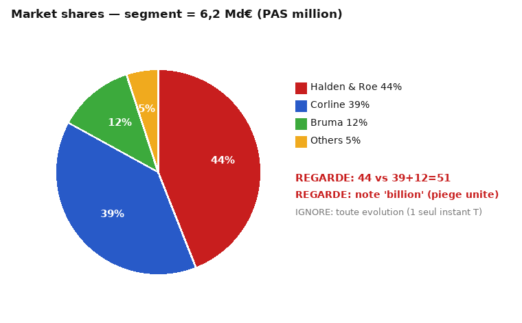
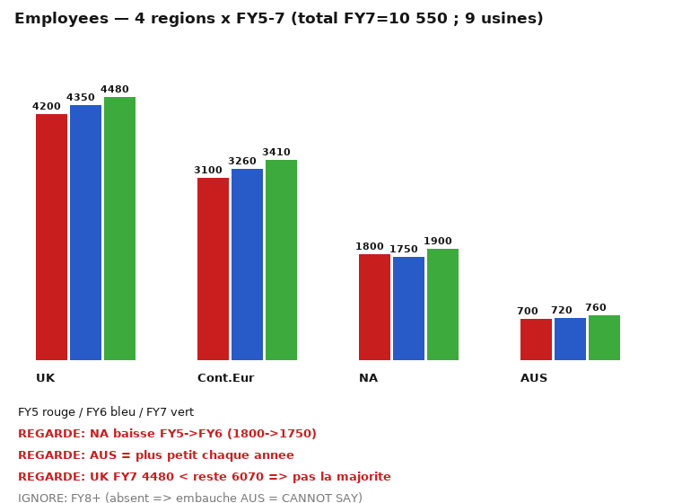
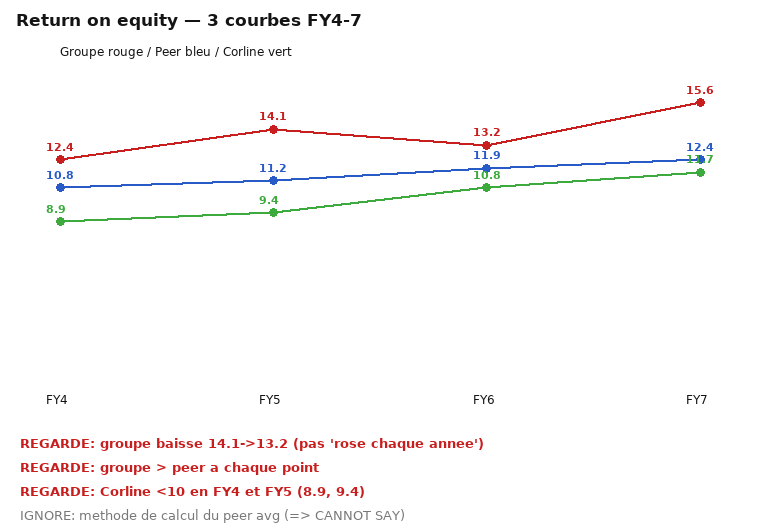
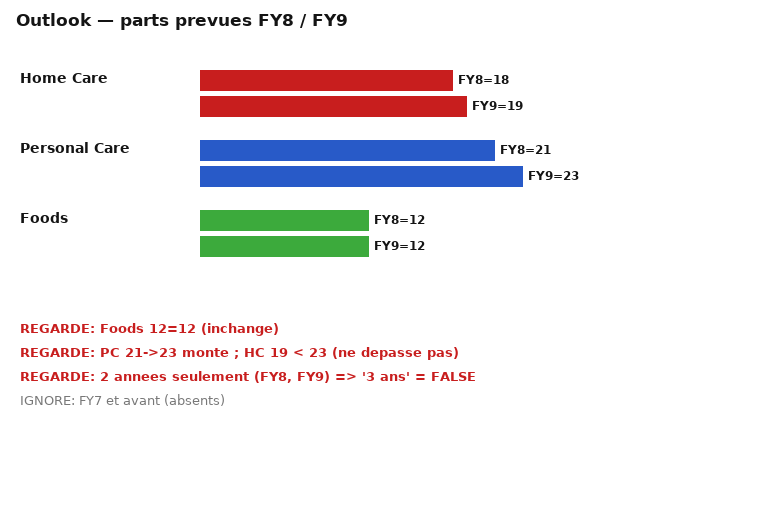

# MÉMO 02 — RAISONNEMENT NUMÉRIQUE (37 affirmations, 12:00)

> 🏋️ **Avant le test, entraîne-toi :** [EX-02 · 65 items](exos/exos-02-numerique.md) — ROE · capitalisation · effectifs · outlook · marge.
> Chaque item donne la réponse **et le piège à éviter** : lis le piège même quand tu as juste.

> Format Aon/cut-e « scales numerical » : 37 affirmations TRUE / FALSE / CANNOT SAY, **6 feuilles de
> données navigables librement** (la question reste affichée quand tu changes d'onglet), 12 minutes.
> « Most people cannot complete all 37 tasks in 12 minutes » — la vitesse fait partie de la note, mais
> **l'exactitude d'abord**. Chaque item ci-dessous indique **en gras** la/les cellule(s) exacte(s) à regarder.

## 1. Histoire / ce qui est évalué
Famille Aon/cut-e. Lecture rapide de tableaux/camemberts/barres/courbes + calcul mental simple +
discipline TRUE/FALSE/CANNOT SAY (ne rien inférer au-delà des données). Un CANNOT SAY correct vaut un
TRUE correct.

## 2. Repères humains (indicatif, non vérifié)
Naïf 12-16 items/12 min · entraîné (Dauphine/HEC) 22-28 · très entraîné/senior 30-35.
Toi : **25-30 à ≥ 90%** plutôt que 37 bâclés. Budget ≈ 19 s/item ; lecture directe 8-10 s, calcul 25-30 s.

## 3. TABLES DE RÉFÉRENCE (à connaître par cœur)
**Income (M€)** — Revenues **38 210 / 41 905 / 44 360** · Total costs 27 040 / 28 590 / 30 085 ·
Operating income **11 170 / 13 315 / 14 275** · Home Care 15 240/16 300/17 120 ·
Personal Care 14 890/16 705/18 040 · Foods 8 080/8 900/9 200.
**Costs (M€)** — Personnel **12 480/13 210/13 890** (plus grosse ligne) · Material 4 120/4 380/4 610 ·
Energy **610/720/845** · Depreciation 2 240/2 310/2 395 · External 980/1 105/1 180 · Admin 860/905/940 ·
R&D 1 420/1 560/1 690 · Marketing **3 480/3 720/3 980** · IT 310/420/465 · Restructuring **540/260/90** ·
Total costs 27 040/28 590/30 085.

**Shares** : Halden&Roe **44** / Corline **39** / Bruma **12** / Others **5** — note = **6.2 billion €** (PAS million).
**Employees** : UK 4200/4350/4480 · Cont.Eur 3100/3260/3410 · NA **1800/1750/1900** · AUS **700/720/760** ;
total FY7 = **10 550** ; 9 plants → ~1 172/plant.
**ROE** : groupe **12.4/14.1/13.2/15.6** · peer 10.8/11.2/11.9/12.4 · Corline 8.9/9.4/10.8/11.7.
**Outlook** : Home 18/19 · Pers **21/23** · Foods **12/12** (FY8/FY9 seulement).

## 4. Astuces vitesse
1. Réponds en 1ʳ passe tout ce qui est « stated » ou lecture d'une ligne ; marque les calculs.
2. % rapides : ×1.15 ; 44 360/38 210 : 38 210×1.15=43 941 < 44 360 → >15%.
3. CANNOT SAY dès qu'une année/ventilation est **absente** (FY8, per subsidiary, évolution d'un camembert).
4. Unités million vs billion ; « per subsidiary » vs total = les 2 pièges.
5. Calculatrice + papier ; arrondis pour comparer.

## 5. CORRECTION UNE PAR UNE (37) — avec où regarder en gras
1. [Income] Revenues increased in every year. → **TRUE** — regarde **ligne Revenues FY5→FY7** (38 210→41 905→44 360).
2. [Income] Operating income FY7 lower than FY6. → **FALSE** — **Operating income FY6 & FY7** (13 315 vs 14 275).
3. [Income] PC grew more than HC FY5→FY7. → **TRUE** — **PC FY5&FY7** (+3 150) vs **HC FY5&FY7** (+1 880).
4. [Income] Foods fell in FY6. → **FALSE** — **Foods FY5&FY6** (8 080→8 900 : monte).
5. [Income] FY7 > +15% vs FY5. → **TRUE** — **Revenues FY5&FY7** (44 360/38 210 = +16.1%).
6. [Income] expects >46 000 in FY8. → **CANNOT SAY** — **aucune cellule FY8** dans Income.
7. [Costs] Personnel largest each year. → **TRUE** — **ligne Personnel vs toutes les autres**, chaque colonne.
8. [Costs] Energy more than doubled. → **FALSE** — **Energy FY5&FY7** (610→845 = ×1.39).
9. [Costs] Restructuring fell every year. → **TRUE** — **Restructuring FY5→FY7** (540→260→90).
10. [Costs] Marketing > R&D each year. → **TRUE** — **Marketing & R&D**, chaque colonne (3 480>1 420…).
11. [Costs] Total FY7 = 30 085. → **TRUE** — **Total costs FY7**.
12. [Costs] External stated per subsidiary. → **CANNOT SAY** — **pas de colonne 'per subsidiary'** (totaux groupe).
13. [Shares] Halden largest. → **TRUE** — **tranche 44%** vs 39%.
14. [Shares] Corline+Bruma > half. → **TRUE** — **tranches 39% & 12%** (=51%).
15. [Shares] four players equal. → **FALSE** — **les 4 tranches** (44/39/12/5).
16. [Shares] Others = 5%. → **TRUE** — **tranche 5%**.
17. [Shares] revenue in million €. → **FALSE** — **la NOTE** sous le camembert (6.2 **billion**).
18. [Shares] Corline increased YoY. → **CANNOT SAY** — **pas de 2ᵉ instant** (camembert = 1 instant T).
19. [Employees] total increased every year. → **TRUE** — **somme des 4 régions** par année (9 800→10 080→10 550).
20. [Employees] NA fell FY5→FY6. → **TRUE** — **barres NA FY5&FY6** (1 800→1 750).
21. [Employees] UK > all others FY7. → **FALSE** — **UK FY7 (4 480)** vs **somme des 3 autres FY7 (6 070)**.
22. [Employees] AUS smallest every year. → **TRUE** — **barres AUS** chaque année (700/720/760).
23. [Employees] avg/plant >1 000 FY7. → **TRUE** — **total FY7 (10 550)** / 9 plants ≈ 1 172.
24. [Employees] plans to hire in AUS FY8. → **CANNOT SAY** — **pas de FY8**.
25. [ROE] group > peer every year. → **TRUE** — **courbe rouge vs bleue**, chaque point.
26. [ROE] group rose every year. → **FALSE** — **points rouges FY5&FY6** (14.1→13.2 : baisse).
27. [ROE] Corline <10% FY4&FY5. → **TRUE** — **courbe verte FY4&FY5** (8.9 & 9.4).
28. [ROE] group 15.6% FY7. → **TRUE** — **point rouge FY7**.
29. [ROE] peer average includes H&R. → **CANNOT SAY** — **pas de méthode** affichée.
30. [Outlook] PC rises FY8→FY9. → **TRUE** — **barres PC FY8&FY9** (21→23).
31. [Outlook] foods unchanged. → **TRUE** — **barres Foods FY8&FY9** (12 & 12).
32. [Outlook] HC overtakes PC by FY9. → **FALSE** — **barres HC & PC FY9** (19 vs 23).
33. [Outlook] covers three years. → **FALSE** — **nb de barres = 2** (FY8 & FY9).
34. [Costs+Income] costs grew slower than revenues. → **TRUE** — **Total costs FY5&FY7** (+11.3%) vs **Revenues FY5&FY7** (+16.1%).
35. [Income] operating margin improved. → **TRUE** — **Operating income & Revenues FY5&FY7** (29.2%→32.2%).
36. [Employees] NA > AUS FY7. → **TRUE** — **barres NA & AUS FY7** (1 900 vs 760).
37. [Shares] H&R = Corline+Bruma. → **FALSE** — **tranche 44%** vs **39%+12% (=51%)**.

## 6. Motifs récurrents
- « increased in every year » → vérifie **chaque paire** (une baisse = FALSE).
- « doubled / +X% » → calcule le ratio.
- « per subsidiary / per plant / includes X » → souvent **CANNOT SAY**.
- Camembert = 1 instant T → toute évolution = CANNOT SAY.
- Unité million vs billion = FALSE si tu ne lis pas la note.
