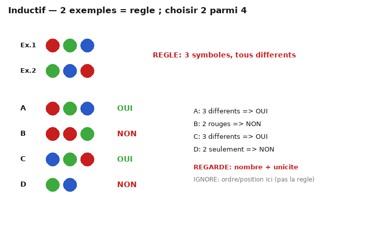

# MÉMO 04 — RAISONNEMENT INDUCTIF (≈ 6:00)

> 🏋️ **Avant le test, entraîne-toi :** [EX-04 · 50 items](exos/exos-04-inductif.md) — suites numériques · suites de lettres · matrices 2×2.
> Chaque item donne la réponse **et le piège à éviter** : lis le piège même quand tu as juste.

> Format cut-e : on te montre **2 exemples qui suivent une règle**, puis **4 candidats** ; tu dois
> choisir **exactement les 2** qui respectent la même règle (bouton ▶▶). Chrono global ~6 min.
> La règle porte sur **nombre / position / couleur / orientation** des symboles (rond, carré, triangle, croix).

## 1. Histoire / ce qui est évalué
Famille « inductive / abstract reasoning » d'Aon-cut-e (et cousin des matrices SHL). Évalue la
**découverte de règle** à partir d'exemples, sans langage ni calcul : c'est le meilleur prédicteur de
l'apprentissage de nouveautés. Valorisé : trouver la règle **vite** et ne pas sur-interpréter (une seule
règle compte, pas trois).

## 2. Niveau attendu / repères (indicatif, non vérifié)
Profil sélectif type Dauphine/HEC entraîné : 8-10 items en 6 min à >85%. Non entraîné : 4-6 avec des
erreurs. Toi : vise 6-8 **sans erreur** plutôt que 12 au hasard. La règle est simple ; c'est la
vérification systématique qui fait la note.

## 3. Structure d'une « bonne » question (comment elles sont fabriquées)

- Les 2 exemples partagent **1 à 2 invariants** (nb de symboles, unicité, position, couleur).
- Parmi les 4 candidats : **2 respectent**, **2 violent** chacun d'une façon différente.
- Formule la règle **à voix haute en une phrase** avant de regarder les candidats ; si elle ne départage
  pas 2/2, elle est mauvaise → reformule.

## 4. Méthode en 4 temps (≤ 40 s/item)
1. **Compte** (nb de symboles, nb par couleur) sur les 2 exemples → invariant de nombre ?
2. **Position** (1ʳᵉ/dernière case, adjacent, diagonale) → invariant de place ?
3. Énonce la règle en une phrase.
4. Teste chaque candidat **contre la phrase** ; coche les 2 conformes. Si un candidat te fait douter,
   reviens à la phrase, pas à l'intuition.

## 5. Pièges
- Règle **négative** (« jamais deux rouges côte à côte ») : les candidats pièges montrent deux rouges
  séparés pour te faire croire que c'est ok.
- Couleur = leurre fréquent : la règle est souvent de **nombre/position**, la couleur ne compte pas.
- Ne suppose pas que la règle vue à l'item n s'applique à l'item n+1 (règles indépendantes).

## 6. Catalogue des règles fréquentes (comment les reconnaître)
| Famille de règle | Signal pour la repérer | Ce qui piège |
|---|---|---|
| **Nombre constant** (« toujours 3 symboles ») | les 2 exemples ont le même compte | candidats à 2 ou 4 symboles |
| **Unicité** (« tous différents ») | aucune couleur répétée dans les exemples | candidat avec un doublon |
| **Position** (« le rouge jamais en 1ʳᵉ ») | compare la 1ʳᵉ case des 2 exemples | candidat qui met le rouge en 1ʳ |
| **Compte par couleur** (« exactement 1 vert ») | compte chaque couleur dans les exemples | candidat avec 2 verts |
| **Parité / alternance** | motif régulier de formes | candidat qui casse l'alternance |

**Ordre de test** : nombre → unicité → position → couleur. La règle est presque toujours dans les 2 premiers.

## 7. Item travaillé (comme sur l'image §3)
Exemples : [rouge,vert,bleu] et [vert,bleu,rouge] → règle = **3 symboles, tous différents**.
- A [r,v,b] → OUI (3 différents). B [r,r,v] → NON (doublon rouge). C [b,v,r] → OUI. D [v,b] → NON (2 seulement).
→ coches **A et C**. Remarque : l'**ordre** change entre exemples → l'ordre n'est PAS la règle (à ignorer).

## 8. Sur le trainer
Le générateur produit des règles de nombre/position avec une paire correcte unique. Entraîne-toi à
**énoncer la règle avant de cliquer** ; si le trainer te signale une ambiguïté, note-la et passe —
l'objectif est la méthode, pas le score d'une planche.
