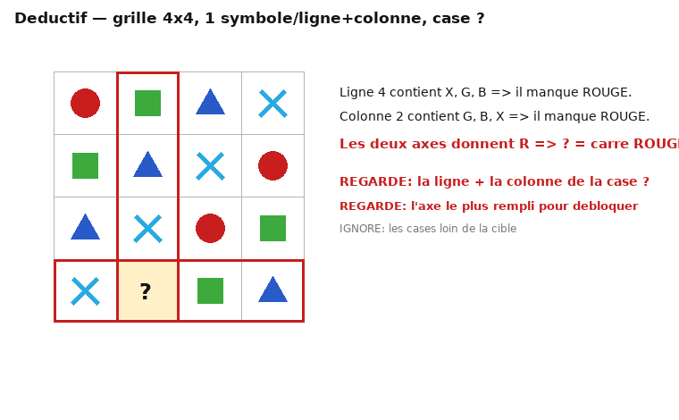

# MÉMO 05 — RAISONNEMENT DÉDUCTIF (grille 4×4) + switchChallenge

> Deux épreuves « logiques » distinctes sur le trainer :
> **(A) Pensée logique déductive** : grille 4×4 partiellement remplie de 4 symboles (carré rouge, rond
> vert, triangle bleu, croix bleu clair), une case « ? », contraintes **une seule occurrence par ligne et
> par colonne** ; 4 options ; ~6 min, avance automatique.
> **(B) switchChallenge** : machine à codes de permutation à 4 chiffres ; on te donne entrée → sortie et
> tu identifies le bon code parmi 3 ; niveaux croissants ; ~6 min.

## A. Déductif 4×4
### 1. Ce qui est évalué
Déduction pure (type sudoku miniature) : appliquer des contraintes **ligne/colonne** jusqu'à forcer une
case. Valorisé : rigueur + vitesse ; il n'y a **jamais d'ambiguïté** — la case cible est déterminée.

### 2. Repères (indicatif) : entraîné 10-12 grilles/6 min ; non entraîné 5-7. Vise 8-10 sans faute.

### 3. Méthode qui marche (≤ 30 s/grille)

1. Regarde d'abord la **ligne ET la colonne** de la case « ? » : liste les symboles déjà présents.
2. La réponse = le seul symbole **absent** de sa ligne et de sa colonne (parfois il faut remplir une case
   intermédiaire pour débloquer : choisis la ligne/colonne la plus remplie).
3. Élimine les options contenant un symbole déjà présent sur la ligne/colonne → il reste 1.

### 4. Pièges
- Grilles « presque pleines » du trainer : la réponse semble directe, mais vérifie **les deux** axes
  (ligne + colonne), pas un seul.
- Ne pars pas d'une case vide au hasard : pars de la ligne/colonne **la plus contrainte**.

### 5. Item travaillé (comme sur l'image)
Ligne 4 = [croix, ?, carré vert, triangle] → il manque **rouge ou croix**? Non : la ligne a déjà croix,
vert, bleu → il manque **rouge**. Colonne 2 = [vert, triangle, croix, ?] → il manque **rouge**.
Les deux axes concordent → **? = rond rouge**. Si ligne et colonne donnaient deux réponses différentes,
c'est que tu as mal lu une case → relis.

### 6. Routine d'entraînement
Fais 3 grilles « à voix haute » (tu énonces ligne puis colonne) sans chrono, puis 5 grilles chrono.
Cible : **≤ 30 s/grille, 0 erreur**. Le jour J, l'avance automatique punit l'hésitation : décide et avance.

## B. switchChallenge
### 1. Ce qui est évalué
Mécanique de **permutation** : un code à 4 chiffres décrit comment réordonner 4 positions. Évalue la
mémoire de travail + la vitesse de transformation mentale.

### 2. Méthode
1. Écris l'entrée en grand, puis applique le code **position par position** sur papier (ne fais pas ça
   de tête au-delà de 2 niveaux).
2. Compare la sortie obtenue aux 3 codes proposés ; élimine dès la 1ʳ position fausse.
3. Les niveaux montent en longueur : garde le papier organisé (1 colonne par niveau).

### 3. Piège classique
Confondre « le code donne la position d'origine » vs « la position d'arrivée ». Fixe la convention sur
l'exemple non noté et **tiens-la** pour tout l'item.
