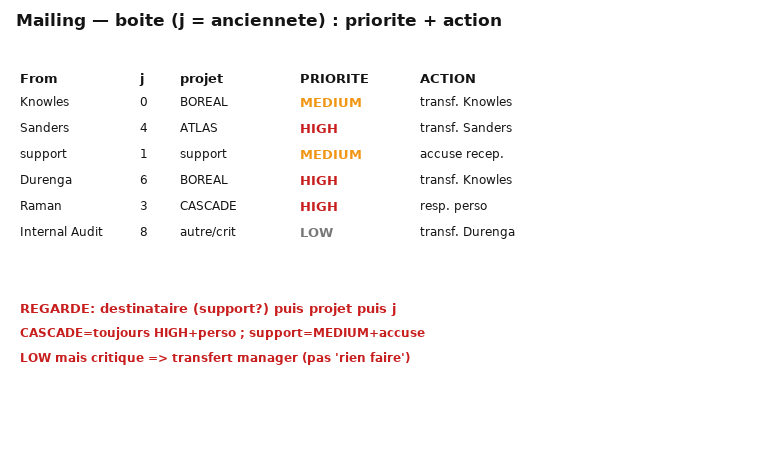
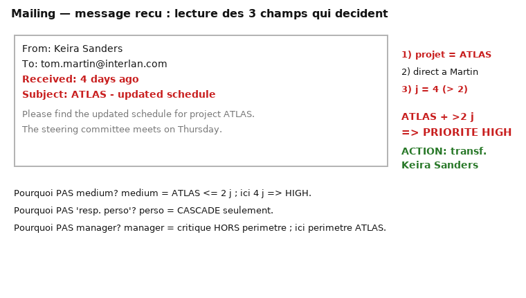

# MÉMO 07 — TRAITEMENT DE L'INFORMATION (boîte mail, 15:00)

> Simulation cut-e « information handling » : tu es **tom.martin@interlan.com** (marketing). Une boîte de
> réception se remplit **pendant** l'épreuve ; pour chaque mail tu dois (1) fixer la **priorité**
> HIGH / MEDIUM / LOW et (2) choisir la bonne **action**. Les consignes restent consultables. 15:00 global.
> C'est l'épreuve que tu « ne comprends pas » — elle devient mécanique dès qu'on pose les deux barèmes.

## 1. Ce qui est évalué
Appliquer **des règles écrites** sous afflux d'information, sans les confondre, en séparant **priorité**
(urgence) et **action** (qui traite). Valorisé : 0 confusion de règle, bonne gestion des mails qui
arrivent en cours de test.

## 2. LES RÈGLES (recopie-les au brouillon avant de commencer)
**PRIORITÉ**
- **HIGH** si : (a) lié à **ATLAS** ET envoyé il y a **> 2 jours** · (b) envoyé **directement à M. Martin**
  sur **BOREAL** il y a **> 5 jours** · (c) lié à **CASCADE** (toujours).
- **MEDIUM** si : (d) ATLAS envoyé dans les **2 derniers jours** · (e) BOREAL direct à Martin dans les
  **5 derniers jours** · (f) adressé à **marketing.support@interlan.com**.
- **LOW** : tout le reste.

**ACTION**
- ATLAS → **transférer à Keira Sanders**.
- BOREAL → **transférer à Daniel Knowles**.
- adressé à marketing.support → **envoyer un accusé de réception**.
- CASCADE → **tu es personnellement responsable** (pas de transfert).
- mail dont tu n'es pas responsable mais que tu juges **critique** → **transférer à ton manager Walter Durenga**.

**Ordre de lecture d'un mail** : 1) destinataire (support ? direct ?) → 2) projet (ATLAS/BOREAL/CASCADE/autre)
→ 3) ancienneté (d jours) → priorité ; puis action par le projet. **Priorité et action sont indépendantes.**

## 3. La boîte et un message, annotés

### Pourquoi cette réponse plutôt qu'une autre (les 4 discriminations qui piègent)
- **ATLAS 4 j vs 2 j** : « > 2 jours » = HIGH ; « ≤ 2 jours » = MEDIUM. La frontière est à 2 → un mail ATLAS
  de 2 j pile est MEDIUM, de 3 j il est HIGH. Regarde **Received** avant tout.
- **CASCADE** : toujours HIGH **et** responsable perso → jamais « transférer », jamais MEDIUM/LOW.
- **support** : toujours MEDIUM + accusé de réception, quel que soit l'expéditeur/sujet → ne classe jamais
  un mail support en HIGH.
- **Critique hors périmètre** (ex. Internal Audit) : priorité **LOW** MAIS action = transfert manager.
  Le piège est de cocher « LOW + rien faire » : la priorité et l'action sont **indépendantes**.

## 4. Exemples travaillés (boîte du trainer) — priorité + action + pourquoi
1. *Knowles → Martin, d0, BOREAL* → **MEDIUM** (e : BOREAL direct ≤ 5 j) · action **transf. Daniel Knowles**.
2. *Sanders → Martin, d4, ATLAS* → **HIGH** (a : ATLAS > 2 j) · **transf. Keira Sanders**.
3. *marketing.support → support, d1* → **MEDIUM** (f) · **accusé de réception**.
4. *Durenga → Martin, d6, BOREAL* → **HIGH** (b : BOREAL direct > 5 j) · **transf. Daniel Knowles**.
5. *Raman → Martin, d3, CASCADE* → **HIGH** (c) · **responsable perso**.
6. *Office Supplies → support, d2* → **MEDIUM** (f) · **accusé de réception**.
7. *Sanders → Martin, d1, ATLAS* → **MEDIUM** (d : ≤ 2 j) · **transf. Keira Sanders**.
8. *Internal Audit → Martin, d8, autre, critique* → **LOW** (aucune règle H/M) MAIS **critique & non
   responsable → transf. Walter Durenga**. ← le piège : priorité LOW ≠ pas d'action.
9. *Knowles → Martin, d6, BOREAL* → **HIGH** (b) · **transf. Daniel Knowles**.
10. *Fischer → Martin, d0, CASCADE* → **HIGH** (c) · **responsable perso**.
11. *Trade Fair → support, d5* → **MEDIUM** (f) · **accusé de réception**.
12. *Durenga → Martin, d2, ATLAS* → **MEDIUM** (d) · **transf. Keira Sanders**.

## 5. Méthode pendant les 15 min
1. Traite d'abord la boîte initiale **dans l'ordre**, en appliquant le checklist §2 à chaque mail.
2. Quand un mail **arrive en cours de test**, traite-le **à son tour d'arrivée** (sa règle d'ancienneté se
   calcule à l'instant t) — ne le laisse pas pourrir : un ATLAS qui vieillit passe de MEDIUM à HIGH.
3. Garde le tableau §2 sous les yeux ; ne mémorise pas « de tête » les seuils 2 j / 5 j.

## 6. Pièges récurrents
- **ATLAS 2 jours pile** = MEDIUM (règle d : « in the last 2 days ») ; **> 2 j** = HIGH. La frontière est à 2.
- **BOREAL** : seul le mail **direct à Martin** compte ; l'ancienneté 5 j sépare MEDIUM/HIGH.
- **CASCADE = toujours HIGH + responsable perso** (jamais transférer, sauf si tu ne t'estimes pas responsable).
- **support** = toujours MEDIUM + accusé de réception, peu importe l'expéditeur/le sujet.
- **Critique hors périmètre** = LOW mais transfert manager (exemple 8) : ne coche pas « LOW + rien faire ».

## 7. Objectif zéro hasard
Refais la boîte du trainer jusqu'à **0 erreur de règle** sur 2 runs consécutifs ; chronomètre-toi pour
finir la boîte initiale en < 6 min, ce qui laisse de l'air pour les mails entrants.
