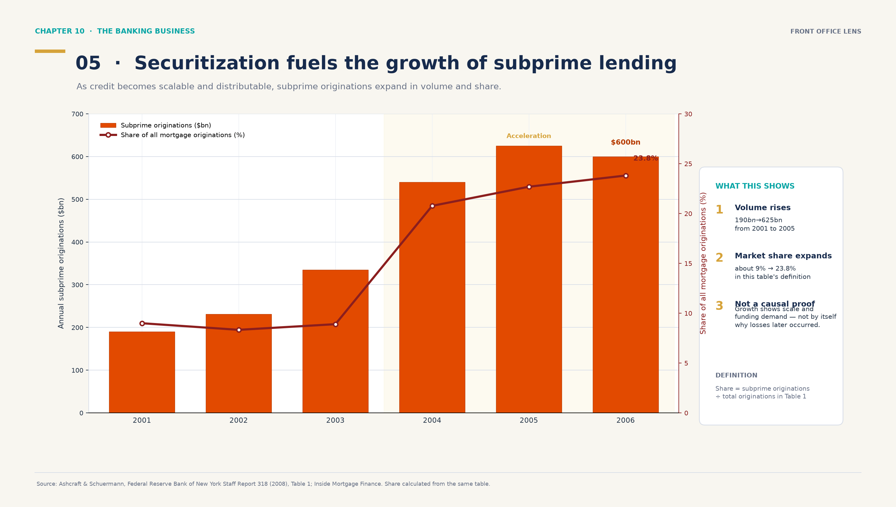
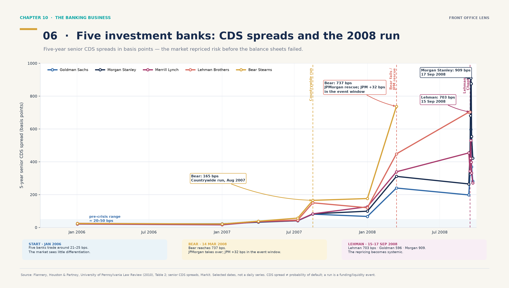
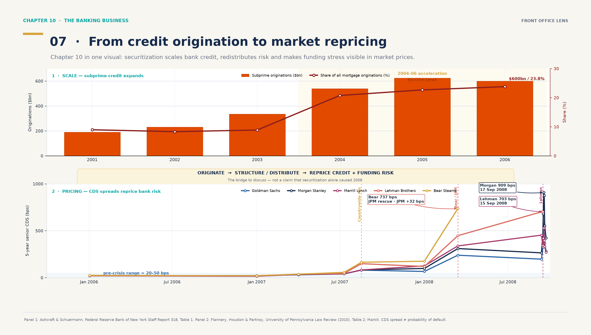
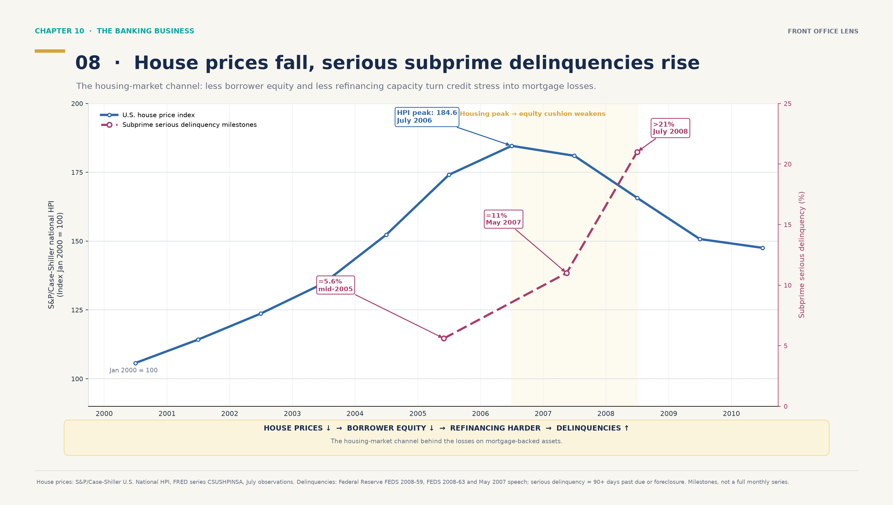

# Illustrations — Chapter 10, slides 9–10

Ce dossier rassemble **huit illustrations candidates** pour les slides 9–10 du Chapter 10 — *The Banking Business*. Les quatre premières sont des schémas de mécanisme ; les quatre dernières sont des graphiques de données. La recommandation finale est désormais d’utiliser **05 pour la slide 9** et **08 pour la slide 10**. Les visuels 06 et 07 restent des fichiers de réserve, mais le panneau CDS à cinq banques n’est pas retenu pour le deck final. Elles sont conçues comme des visuels de présentation, et non comme de simples éléments décoratifs : chaque image relie un mécanisme financier à une question de banque, de front office ou de gestion des risques.

> **Statut :** options de travail à sélectionner avant la création du PowerPoint final. Le deck des slides 9–10 n’est pas encore généré.

## Vue d’ensemble

| Fichier | Sujet | Utilisation la plus naturelle |
|---|---|---|
| [01 — du subprime au crédit structuré](output/01_subprime_to_structured_credit.png) | Emprunteur → banque/originator → pool/SPV → tranches → investisseurs | Slide 9 : expliquer la chaîne de titrisation |
| [02 — cash-flow et loss waterfalls](output/02_cashflow_and_loss_waterfalls.png) | Priorité des paiements et ordre inverse d’absorption des pertes | Slide 9 : rendre le tranching et la waterfall concrets |
| [03 — cash-flows et protection d’un CDS](output/03_cds_cashflows_and_protection.png) | Prime, événement de crédit, recovery, LGD et paiement contingent | Slide 10 : transfert et couverture du risque de crédit |
| [04 — crise, stress de liquidité et réponse prudentielle](output/04_crisis_to_basel_timeline.png) | Faiblesse d’origination → complexité → levier → défauts → liquidité/contagion → Basel | Slide 10 : relier le front office à la crise et à la régulation |
| [05 — croissance du subprime : graphique combiné](output/05_subprime_growth_combo_chart.png) | Barres = volume annuel ; courbe = part des nouvelles origines hypothécaires | Slide 9 : montrer la croissance du marché sans schéma en cubes |
| [06 — cinq banques, spreads CDS et run de 2008](output/06_bank_cds_spreads_and_funding_stress.png) | Cinq lignes colorées, événements fléchés et niveaux clés de Goldman, Morgan Stanley, Merrill, Lehman et Bear | Réserve uniquement : trop dense pour le deck final |
| [07 — de l’origination au repricing de marché](output/07_ch10_core_credit_to_market_risk.png) | Ancien visuel combiné : expansion du crédit subprime puis repricing CDS des cinq banques | Réserve de travail, non retenue |
| [08 — prix immobiliers et défauts subprime](output/08_house_prices_and_subprime_delinquencies.png) | Indice national des prix immobiliers américains et jalons de serious delinquency des prêts subprime | **Slide 10 : recommandation finale** |

Les huit fichiers sont au format **16:9**, avec un style cohérent et une hiérarchie adaptée à une slide de cours : titre, mécanisme central ou série de données, exemple chiffré, puis une note de prudence en bas de page.

## 01 — From a subprime mortgage to structured credit


Cette illustration montre comment un prêt individuel devient une exposition structurée :

1. l’emprunteur présente un profil de crédit plus risqué ;
2. la banque accorde et peut gérer le prêt ;
3. les prêts sont regroupés dans un pool et associés à un SPV ;
4. le SPV émet des notes réparties en tranches ;
5. les investisseurs achètent des expositions différentes aux flux, au spread et au risque.

Le cartouche **“What ‘subprime’ means”** évite une simplification excessive : *subprime* désigne ici un profil de crédit plus risqué, et non une catégorie juridique universelle. L’explication utilise les notions de **PD** (*probability of default*) et de **LTV** (*loan-to-value*).

L’exemple pédagogique représente **100 mortgages = €100m**, répartis en **€80m senior, €15m mezzanine et €5m equity**. Les montants sont explicitement illustratifs et ne décrivent pas une transaction historique.

**Pourquoi elle est pertinente pour la slide 9 :** c’est le meilleur schéma d’introduction. Il relie l’origination bancaire, le financement, la structuration, la distribution et les différents mandats d’investisseurs en une seule chaîne.

## 02 — Waterfall: who gets paid, who absorbs the loss?


Cette illustration isole le point souvent le plus difficile à retenir :

- les **collections** sont distribuées selon la priorité contractuelle — senior, puis mezzanine, puis equity/residual ;
- les **pertes** frappent généralement les protections dans l’ordre inverse — equity, puis mezzanine, puis senior.

Les trois scénarios de **€4m, €7m et €22m de pertes** montrent concrètement quand l’equity est absorbée, quand la mezzanine commence à subir des pertes et quand la protection senior est atteinte.

**Pourquoi elle est pertinente pour la slide 9 :** elle transforme le vocabulaire *tranching*, *subordination* et *waterfall* en une logique immédiatement lisible. Elle rappelle également qu’une tranche senior n’est pas sans risque : elle est touchée plus tard dans cet exemple, mais reste exposée aux pertes extrêmes, à la liquidité et aux hypothèses de la structure.

## 03 — CDS: transferring credit risk without necessarily selling the asset


Cette illustration présente un **Credit Default Swap comme un dérivé de crédit bilatéral** :

- l’acheteur de protection paie une prime périodique, exprimée par le **CDS spread** ;
- le vendeur de protection reçoit cette prime et prend une exposition contingente ;
- si un événement de crédit défini par le contrat survient, un paiement de protection est effectué selon les modalités prévues.

L’exemple pédagogique utilise :

- **€10m de notional** ;
- **250 bps par an**, soit **€250,000 de prime annuelle** ;
- **40 % de recovery**, donc **60 % de LGD** ;
- un paiement illustratif de **€6m** après l’événement de crédit.

Le schéma précise qu’un CDS n’est **pas automatiquement une police d’assurance** : il s’agit d’un dérivé dont la documentation définit notamment l’obligation de référence, les événements de crédit, le règlement, la contrepartie et les éventuelles obligations de collatéral.

**Pourquoi elle est pertinente pour la slide 10 :** elle prolonge la titrisation vers le hedging, le pricing et le monitoring de marché. Elle permet de parler du spread, de la recovery, du risque de contrepartie, du collatéral et de la liquidité sans prétendre que la banque vend nécessairement l’actif sous-jacent.

## 04 — From structured credit to systemic stress and regulation


Cette illustration propose une lecture prudente de la crise :

> faiblesse de l’origination → complexité RMBS/CDO → levier et hors-bilan → défauts et dégradations → margin calls et fire sales → stress de liquidité et contagion.

Elle ne présente **pas la titrisation comme la cause unique de 2008**. Le message est celui d’une combinaison d’incitations mal alignées, de standards de crédit, de levier, d’opacité, de dépendance aux ratings et de liquidité de marché.

La bande réglementaire met en regard **Basel I**, **Basel II**, **Basel III** et **“Basel IV”**. L’astérisque rappelle que **Basel IV est un surnom de marché désignant les réformes finales de Basel III, et non un accord officiel séparé**.

**Pourquoi elle est pertinente pour la slide 10 :** elle relie l’activité de structuration et de distribution aux conséquences de marché, au risque systémique et aux réponses prudentielles. C’est l’option la plus adaptée si la slide 10 doit faire le lien avec la crise de 2008 et la régulation contemporaine.

## 05 — Growth of subprime mortgage lending



Ce graphique reprend la logique du modèle fourni :

- les **barres orange** montrent le volume annuel de nouvelles origines subprime, en **milliards de dollars** ;
- la **courbe bordeaux** montre la part des origines subprime dans l’ensemble des origines hypothécaires ;
- la zone jaune met en évidence l’accélération de **2004 à 2006**.

La série est volontairement limitée à **2001–2006**, période pour laquelle une définition homogène et une table chiffrée sont disponibles dans la source retenue. Les volumes sont : **$190bn, $231bn, $335bn, $540bn, $625bn et $600bn**. La part est calculée à partir de la même table : subprime / (subprime + Alt-A + jumbo + agency), soit environ **9.0 %, 8.3 %, 8.9 %, 20.8 %, 22.7 % et 23.8 %**.

Le graphique est plus simple à lire qu’un schéma de cubes : il montre immédiatement la **taille du marché**, son **accélération** et la **part croissante** du subprime. Il ne prétend pas démontrer à lui seul la causalité de la crise ; il donne l’échelle du phénomène et prépare ensuite l’explication de la titrisation, des incitations et du risque.

**Pourquoi elle est pertinente pour la slide 9 :** c’est désormais le visuel recommandé si l’objectif est de faire comprendre le boom du subprime avant d’expliquer la structuration. Il peut remplacer les illustrations 01–02, qui restent disponibles pour une slide plus technique.

**Source des données :** Ashcraft & Schuermann, *Understanding the Securitization of Subprime Mortgage Credit*, Federal Reserve Bank of New York Staff Report no. 318 (2008), Table 1 ; données d’origination Inside Mortgage Finance. Les parts sont calculées à partir de cette table, et non lues approximativement sur le graphique de référence.

## 06 — Five investment banks: CDS spreads and the 2008 run



Cette version est volontairement **zoomée sur cinq banques** et utilise cinq couleurs constantes : **Goldman Sachs, Morgan Stanley, Merrill Lynch, Lehman Brothers et Bear Stearns**.

Le graphique donne une vraie chronologie de marché :

- en janvier 2006, les cinq spreads sont proches de **21–25 bps** ; le marché différencie encore peu les banques ;
- en août 2007, après le run de Countrywide, Bear Stearns atteint **165 bps** ;
- le 14 mars 2008, Bear Stearns atteint **737 bps** et JPMorgan reprend la banque ; le spread de JPMorgan augmente de **32 bps** dans la fenêtre d’événement étudiée ;
- le 15 septembre 2008, Lehman dépose son bilan à **703 bps** ;
- le 17 septembre, Morgan Stanley atteint **909 bps**, Goldman Sachs **596 bps** et Merrill Lynch **530 bps** dans la table de référence.

Les flèches et les lignes verticales ne sont pas décoratives : elles relient chaque événement à un **niveau de spread observable**. L’échelle linéaire **0–1 000 bps** est choisie pour conserver à la fois la zone pré-crise et l’explosion de septembre 2008. Les lignes relient des dates publiées dans la table ; elles ne prétendent pas reconstituer chaque cotation quotidienne.

Le message Sales/Trading est le suivant : le risque devient d’abord **différencié** — Bear puis Lehman s’écartent — avant de devenir **systémique** après Lehman, lorsque Morgan Stanley, Goldman Sachs et Merrill Lynch repricent simultanément leur risque de crédit et de financement.

Un spread CDS est un **prix de protection de crédit**, pas automatiquement une probabilité de défaut. Le run est un événement de financement et de liquidité ; le CDS enregistre la revalorisation du risque et de la protection demandée par le marché.

**Source des données :** Flannery, Houston & Partnoy, *Credit Default Swap Spreads as Viable Substitutes for Credit Ratings*, University of Pennsylvania Law Review (2010), Table 2 ; données Markit. Les événements et variations autour de Bear Stearns, Lehman et JPMorgan sont décrits dans la même étude.

**Pourquoi elle est pertinente pour la slide 10 :** elle transforme la crise en une lecture de marché concrète : un desk observe le spread, la vitesse de widening, la comparaison entre noms, le risque de contrepartie et l’effet d’un sauvetage sur le pricing.

## 07 — From credit origination to market repricing (réserve, non retenue)



Cette illustration est une **ancienne version combinée de travail**. Elle est conservée comme réserve documentaire, mais n’est pas retenue pour le deck final : le panneau CDS à cinq banques est trop chargé pour la lecture de la slide 10.

Elle se lit en deux temps :

1. **Panel 1 — Scale :** le volume des origines subprime passe de **$190bn en 2001 à $625bn en 2005**, puis reste à **$600bn en 2006**, tandis que la part calculée dans la même définition atteint environ **23.8 %**.
2. **Panel 2 — Pricing :** les spreads CDS senior 5 ans de cinq banques restent autour de **21–25 bps en janvier 2006**, puis s’écartent après 2007. Bear Stearns atteint **737 bps** le 14 mars 2008 ; après Lehman, Morgan Stanley atteint **909 bps**, Goldman Sachs **596 bps** et Lehman **703 bps** dans les observations de septembre 2008.

Le bandeau central exprime l’idée de la partie :

> **Originate → structure/distribute → reprice credit and funding risk.**

Le graphique ne dit pas que la croissance du subprime est, à elle seule, une preuve de causalité de la crise. Il montre plutôt la chaîne pédagogique à discuter : montée en échelle du crédit, besoin de structuration et de distribution, puis repricing du risque de crédit et de financement par le marché.

**Statut :** ne pas utiliser ce visuel comme figure principale. La slide 9 conserve le graphique 05 et la slide 10 utilise désormais le graphique 08, plus lisible et directement centré sur le mécanisme immobilier et les défauts subprime.

**Sources :** Panel 1 — Ashcraft & Schuermann, Federal Reserve Bank of New York Staff Report 318 (2008), Table 1 ; Panel 2 — Flannery, Houston & Partnoy, University of Pennsylvania Law Review (2010), Table 2 ; données Markit. Un spread CDS est un prix de protection de crédit et non automatiquement une probabilité de défaut.

## 08 — House prices and subprime serious delinquencies



Ce graphique est le visuel recommandé pour la **slide 10**. Il remplace le panneau CDS à cinq banques par une vraie lecture économique du mécanisme :

- la courbe bleue montre l’indice national S&P/Case-Shiller des prix immobiliers américains ;
- la courbe bordeaux montre des **jalons publiés** du taux de *serious delinquency* des prêts subprime ;
- la zone 2006–2008 attire l’attention sur le retournement des prix et la détérioration du crédit ;
- le bandeau résume la séquence pédagogique : **baisse des prix → perte d’equity → refinancement plus difficile → hausse des impayés → pertes sur le crédit hypothécaire**.

La définition est explicite : *serious delinquency* signifie un prêt avec **au moins 90 jours de retard ou en procédure de foreclosure**. Le graphique ne fabrique pas une série mensuelle à partir de quelques observations : les trois points de la courbe bordeaux sont des repères publiés — environ **5,6 % mi-2005**, **11 % en mai 2007** et **plus de 21 % en juillet 2008** — et la note de bas de page les présente comme tels.

Le message n’est pas une preuve de causalité unique. La baisse des prix a réduit la valeur nette des emprunteurs et leurs possibilités de refinancement, mais les *rate resets*, la qualité de l’underwriting, le levier, les chocs de revenus, les conditions de liquidité et les incitations de la chaîne de titrisation sont également à discuter.

**Sources des données :**

- indice immobilier : [S&P/Case-Shiller U.S. National Home Price Index, FRED CSUSHPINSA](https://fred.stlouisfed.org/series/CSUSHPINSA), source S&P Dow Jones Indices LLC via FRED ; le visuel retient les observations de juillet et conserve la base janvier 2000 = 100 ;
- défauts : [Federal Reserve, FEDS 2008-59](https://www.federalreserve.gov/pubs/feds/2008/200859/200859pap.pdf), [FEDS 2008-63](https://www.federalreserve.gov/pubs/feds/2008/200863/200863pap.pdf) et [le discours de mai 2007](https://www.federalreserve.gov/newsevents/speech/bernanke20070517a.htm), données First American LoanPerformance ; la définition et les séries séparées variable-rate/fixed-rate sont décrites par la Federal Reserve.

## Quelle combinaison retenir pour les deux slides ?

La sélection finale recommandée est :

| Slide | Choix recommandé | Message |
|---|---|---|
| 9 | **05 — croissance du subprime** | L’origination subprime augmente fortement en volume et en part du marché avant la crise. |
| 10 | **08 — prix immobiliers et défauts subprime** | Le pic immobilier de 2006 est suivi d’une baisse des prix, d’une perte d’equity et d’une montée des serious delinquencies. |

- **06** et **07** restent disponibles comme graphiques de réserve, mais ne sont pas recommandés dans le deck final : le suivi des spreads CDS de cinq banques est trop dense pour la slide 10.
- **03** reste pertinent uniquement si la slide 10 doit définir précisément le fonctionnement contractuel d’un CDS.
- **04** reste pertinent si la priorité devient la crise systémique et la régulation plutôt que la séquence prix immobiliers–défauts.

Le lien entre la baisse des prix et les défauts doit être présenté comme un **mécanisme économique à discuter**, pas comme une explication exhaustive ni comme une preuve causale unique.

## Précautions de contenu

- Tous les montants et paramètres chiffrés sont **pédagogiques/illustratifs**, pas des transactions historiques.
- La titrisation transforme et répartit le risque ; elle ne le fait pas disparaître.
- Une tranche senior bénéficie d’une protection relative dans la waterfall, mais n’est pas sans risque.
- Un CDS est présenté comme un dérivé de crédit, pas automatiquement comme une assurance.
- La crise de 2008 est présentée comme le résultat d’une combinaison de facteurs, et non de la titrisation seule.
- Les repères réglementaires doivent être recroisés avec l’édition exacte du cours et les sources retenues avant la version finale du deck.

## Sources de cadrage

- [Guide français des slides 9–10](../CH10-SLIDES-9-10-FRONT-OFFICE-FR.md)
- [Financial Crisis Inquiry Commission Report](https://www.govinfo.gov/content/pkg/GPO-FCIC/pdf/GPO-FCIC.pdf)
- [Federal Reserve History — The Great Recession and Its Aftermath](https://www.federalreservehistory.org/essays/great-recession-and-its-aftermath)
- [Flannery, Houston & Partnoy — CDS spreads and credit ratings](https://www.law.upenn.edu/live/files/22-flannery158upalrev20852010pdf)
- [Federal Reserve Bank of New York — Bear Stearns and Lehman context](https://www.newyorkfed.org/newsevents/speeches/2010/bax100901)
- [FRED — S&P/Case-Shiller U.S. National Home Price Index](https://fred.stlouisfed.org/series/CSUSHPINSA)
- [Federal Reserve — The Past, Present, and Future of Subprime Mortgages](https://www.federalreserve.gov/pubs/feds/2008/200863/index.html)
- [Federal Reserve — The Subprime Mortgage Market, May 2007](https://www.federalreserve.gov/newsevents/speech/bernanke20070517a.htm)
- [Basel Committee — Revisions to the Securitisation Framework](https://www.bis.org/bcbs/publ/d374.htm)
- [Basel Committee — Basel III: Post-Crisis Reforms](https://www.bis.org/bcbs/publ/d424.htm)

## Régénérer les PNG

Depuis la racine du dépôt, avec un environnement Python contenant `matplotlib` :

```bash
python travaux-groupe/Money-Banking/ch10_front_office_illustrations/build_illustrations.py
```

Le script régénère les huit fichiers dans `output/`.
