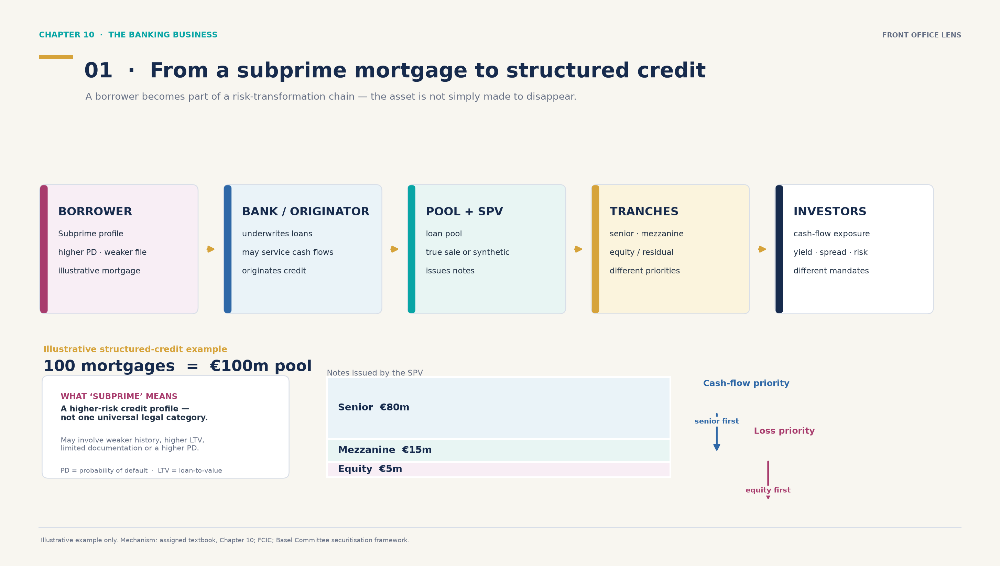
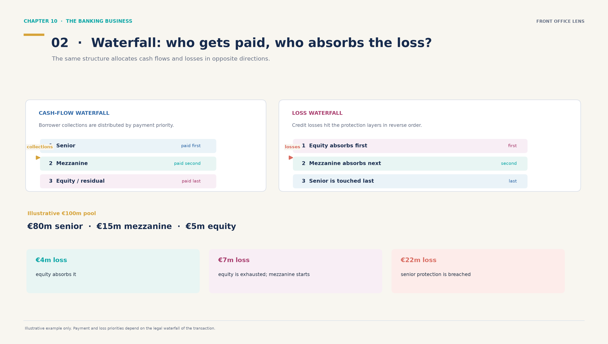
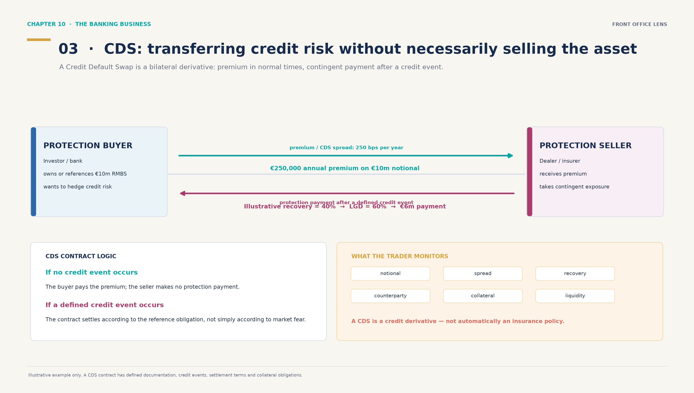
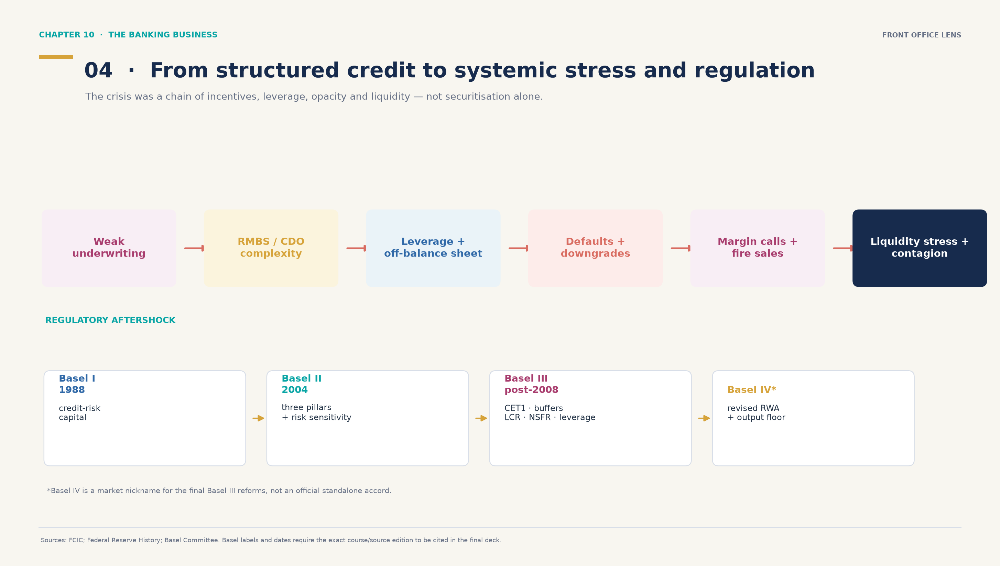

# Illustrations — Chapter 10, slides 9–10

Ce dossier rassemble **quatre illustrations candidates** pour les slides 9–10 du Chapter 10 — *The Banking Business*. Elles sont conçues comme des schémas de présentation, et non comme de simples éléments décoratifs : chaque image relie un mécanisme financier à une question de banque, de front office ou de gestion des risques.

> **Statut :** options de travail à sélectionner avant la création du PowerPoint final. Le deck des slides 9–10 n’est pas encore généré.

## Vue d’ensemble

| Fichier | Sujet | Utilisation la plus naturelle |
|---|---|---|
| [01 — du subprime au crédit structuré](output/01_subprime_to_structured_credit.png) | Emprunteur → banque/originator → pool/SPV → tranches → investisseurs | Slide 9 : expliquer la chaîne de titrisation |
| [02 — cash-flow et loss waterfalls](output/02_cashflow_and_loss_waterfalls.png) | Priorité des paiements et ordre inverse d’absorption des pertes | Slide 9 : rendre le tranching et la waterfall concrets |
| [03 — cash-flows et protection d’un CDS](output/03_cds_cashflows_and_protection.png) | Prime, événement de crédit, recovery, LGD et paiement contingent | Slide 10 : transfert et couverture du risque de crédit |
| [04 — crise, stress de liquidité et réponse prudentielle](output/04_crisis_to_basel_timeline.png) | Faiblesse d’origination → complexité → levier → défauts → liquidité/contagion → Basel | Slide 10 : relier le front office à la crise et à la régulation |

Les quatre fichiers sont au format **16:9**, avec un style cohérent et une hiérarchie adaptée à une slide de cours : titre, mécanisme central, exemple chiffré ou chaîne causale, puis une note de prudence en bas de page.

## 01 — From a subprime mortgage to structured credit



Cette illustration montre comment un prêt individuel devient une exposition structurée :

1. l’emprunteur présente un profil de crédit plus risqué ;
2. la banque accorde et peut gérer le prêt ;
3. les prêts sont regroupés dans un pool et associés à un SPV ;
4. le SPV émet des notes réparties en tranches ;
5. les investisseurs achètent des expositions différentes aux flux, au spread et au risque.

Le cartouche **“What ‘subprime’ means”** évite une simplification excessive : *subprime* désigne ici un profil de crédit plus risqué, et non une catégorie juridique universelle. L’explication utilise les notions de **PD** (*probability of default*) et de **LTV** (*loan-to-value*).

L’exemple pédagogique représente **100 mortgages = €100m**, répartis en **€80m senior, €15m mezzanine et €5m equity**. Les montants sont explicitement illustratifs et ne décrivent pas une transaction historique.

**Pourquoi elle est pertinente pour la slide 9 :** c’est le meilleur schéma d’introduction. Il relie l’origination bancaire, le financement, la structuration, la distribution et les différents mandats d’investisseurs en une seule chaîne.

## 02 — Waterfall: who gets paid, who absorbs the loss?



Cette illustration isole le point souvent le plus difficile à retenir :

- les **collections** sont distribuées selon la priorité contractuelle — senior, puis mezzanine, puis equity/residual ;
- les **pertes** frappent généralement les protections dans l’ordre inverse — equity, puis mezzanine, puis senior.

Les trois scénarios de **€4m, €7m et €22m de pertes** montrent concrètement quand l’equity est absorbée, quand la mezzanine commence à subir des pertes et quand la protection senior est atteinte.

**Pourquoi elle est pertinente pour la slide 9 :** elle transforme le vocabulaire *tranching*, *subordination* et *waterfall* en une logique immédiatement lisible. Elle rappelle également qu’une tranche senior n’est pas sans risque : elle est touchée plus tard dans cet exemple, mais reste exposée aux pertes extrêmes, à la liquidité et aux hypothèses de la structure.

## 03 — CDS: transferring credit risk without necessarily selling the asset



Cette illustration présente un **Credit Default Swap comme un dérivé de crédit bilatéral** :

- l’acheteur de protection paie une prime périodique, exprimée par le **CDS spread** ;
- le vendeur de protection reçoit cette prime et prend une exposition contingente ;
- si un événement de crédit défini par le contrat survient, un paiement de protection est effectué selon les modalités prévues.

L’exemple pédagogique utilise :

- **€10m de notional** ;
- **250 bps par an**, soit **€250,000 de prime annuelle** ;
- **40 % de recovery**, donc **60 % de LGD** ;
- un paiement illustratif de **€6m** après l’événement de crédit.

Le schéma précise qu’un CDS n’est **pas automatiquement une police d’assurance** : il s’agit d’un dérivé dont la documentation définit notamment l’obligation de référence, les événements de crédit, le règlement, la contrepartie et les éventuelles obligations de collatéral.

**Pourquoi elle est pertinente pour la slide 10 :** elle prolonge la titrisation vers le hedging, le pricing et le monitoring de marché. Elle permet de parler du spread, de la recovery, du risque de contrepartie, du collatéral et de la liquidité sans prétendre que la banque vend nécessairement l’actif sous-jacent.

## 04 — From structured credit to systemic stress and regulation



Cette illustration propose une lecture prudente de la crise :

> faiblesse de l’origination → complexité RMBS/CDO → levier et hors-bilan → défauts et dégradations → margin calls et fire sales → stress de liquidité et contagion.

Elle ne présente **pas la titrisation comme la cause unique de 2008**. Le message est celui d’une combinaison d’incitations mal alignées, de standards de crédit, de levier, d’opacité, de dépendance aux ratings et de liquidité de marché.

La bande réglementaire met en regard **Basel I**, **Basel II**, **Basel III** et **“Basel IV”**. L’astérisque rappelle que **Basel IV est un surnom de marché désignant les réformes finales de Basel III, et non un accord officiel séparé**.

**Pourquoi elle est pertinente pour la slide 10 :** elle relie l’activité de structuration et de distribution aux conséquences de marché, au risque systémique et aux réponses prudentielles. C’est l’option la plus adaptée si la slide 10 doit faire le lien avec la crise de 2008 et la régulation contemporaine.

## Quelle combinaison retenir pour deux slides ?

Une sélection possible, à valider avant le PowerPoint :

- **Slide 9 — 01 + 02 :** la première image explique la chaîne de titrisation ; la seconde explique la hiérarchie des flux et des pertes.
- **Slide 10 — 03 ou 04 :** choisir **03** si l’angle prioritaire est le hedging, le pricing et le transfert du risque ; choisir **04** si l’angle prioritaire est la crise, la liquidité et la régulation.

Si une seule illustration doit être retenue par slide :

| Slide | Choix recommandé | Raisonnement |
|---|---|---|
| 9 | **01** | Vue d’ensemble la plus complète du passage du crédit bancaire aux instruments de marché. |
| 10 | **03** ou **04** | **03** pour le front office et le hedging ; **04** pour la crise et la réponse prudentielle. |

L’illustration **02** peut remplacer une partie du texte de la slide 9 si la priorité est la compréhension des tranches et de la waterfall plutôt que la chaîne institutionnelle.

## Précautions de contenu

- Tous les montants et paramètres chiffrés sont **pédagogiques/illustratifs**, pas des transactions historiques.
- La titrisation transforme et répartit le risque ; elle ne le fait pas disparaître.
- Une tranche senior bénéficie d’une protection relative dans la waterfall, mais n’est pas sans risque.
- Un CDS est présenté comme un dérivé de crédit, pas automatiquement comme une assurance.
- La crise de 2008 est présentée comme le résultat d’une combinaison de facteurs, et non de la titrisation seule.
- Les repères réglementaires doivent être recroisés avec l’édition exacte du cours et les sources retenues avant la version finale du deck.

## Sources de cadrage

- [Guide français des slides 9–10](../CH10-SLIDES-9-10-FRONT-OFFICE-FR.md)
- [Financial Crisis Inquiry Commission Report](https://www.govinfo.gov/content/pkg/GPO-FCIC/pdf/GPO-FCIC.pdf)
- [Federal Reserve History — The Great Recession and Its Aftermath](https://www.federalreservehistory.org/essays/great-recession-and-its-aftermath)
- [Basel Committee — Revisions to the Securitisation Framework](https://www.bis.org/bcbs/publ/d374.htm)
- [Basel Committee — Basel III: Post-Crisis Reforms](https://www.bis.org/bcbs/publ/d424.htm)

## Régénérer les PNG

Depuis la racine du dépôt, avec un environnement Python contenant `matplotlib` :

```bash
python travaux-groupe/Money-Banking/ch10_front_office_illustrations/build_illustrations.py
```

Le script régénère les quatre fichiers dans `output/`.
